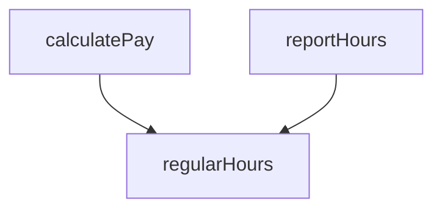
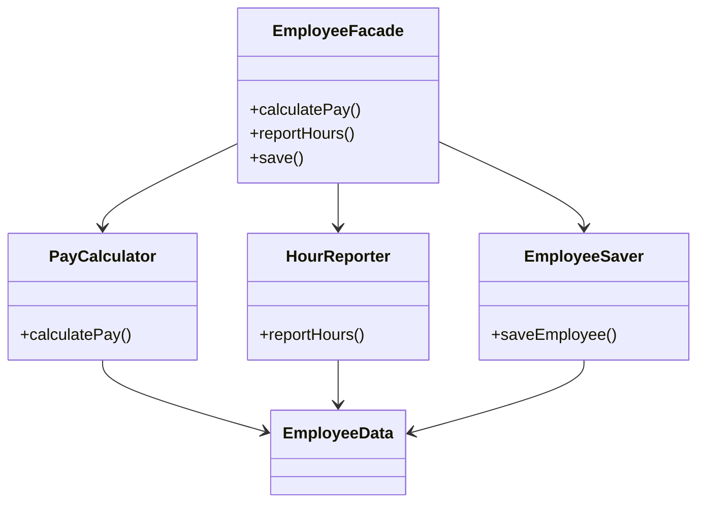
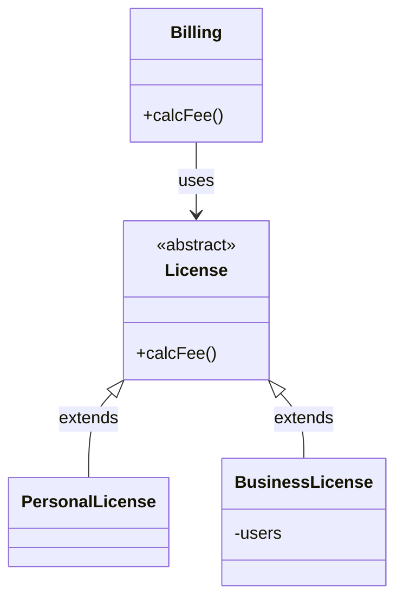

# SOLID 原則

- 能容忍變化
- 容易理解
- 元件的基礎

相關閱讀材料
- Agile Software Development, Principles, Patterns, and Practices
- Agile Principles, Patterns, and Practices in C#

# Ch7. SRP 單一職責原則

**Single Responsibility Principle**

#### 不是：每個模組應做一件事
#### 是：一個模組應該只有一個，且只有一個理由會使其改變

改變是為了滿足使用者和利益相關者，所以我們也可以說：
##### **一個模組應該只對唯一的一個使用者或利益相關者負責。**

再把需要這些變更的人稱為角色 actor 參與者

**一個模組應該只對唯一的一個角色負責。**

### 模組的定義
一個原始檔，或是一個由函式和資料結構相互凝聚（cohensive）在一起的集合。


## 症狀1： 意外重複

```
Employee
calculatePay()   方法由會計部指定，向CFO報告
reportHours()    方法由人力資源部指定，向COO報告
save()           方法由資料庫管理員指定，向CTO報告
```

這個耦合可能會導致CFO團隊的行為影響了COO團隊所依賴的東西。
例如：calculatePay, reportHours共用了計算非加班時間的演算法，叫他regularHours()

CFO團隊決定非加班時間的計算方式需要調整，但是COO不想要。

==**分開不同角色所依賴的程式碼。**==




## 症狀2： 合併

不同團隊對`Employee`類別修改、碰撞，最終合併。
沒有工具可以處理每一個合併案裡，最後總是會有風險。

多人因不同原因而修改相同的原始檔。

**==分離支援不同角色的程式碼。==**

## 解決方案

一個明顯方法是將資料與函式分開。這三個類別共用了`EmployData`，這是一個沒有方法的簡單資料結構。
三個類別不允許了解彼此。因此避免了意外重複。

為了避免時力化和追蹤三個類別，使用`Facade`模式。



每個類別都是一個視野範圍。在這個視野範圍之外，沒有人知道存在這個家族的私有成員。

# Ch8. OCP 開放封閉原則

**Open-Closed Principle**

軟體應該對於擴展開放，對於修改封閉。
Software entities (classes, modules, functions, etc.) should be open for extension, but closed for modification.

架構師根據如何、為什麼級何時發生變更來分離功能，組織元件階層。
高層級元件受到保護，免受低層級元件的變更所影響。

## 總結
OCP是糸統架構背後的推動力之一。目標是使系統易於擴展而不會因修改產生較大的影響。
這個目標是透過將系統劃分為元件，並將這些元件安排到依賴階層中而實現的。
這種階層結構能保護較高層級的元件免受掉低層級元件的變更所影響。


> [!NOTE] 回顧心得
> 我覺得我當初第一次看一定是看不懂的。因為我現在是全部都懂了之後，再來看書上的那張圖，才非常有看懂的感覺。
> 他這張圖初見太複雜了。
> 
> ```mermaid
> graph LR
>     view["view"] --> presenter["presenter"] --> controlloer["controller"] --> interactor["interactor"]
>      database["database"] --> interactor["interactor"]
> ```


# Ch9. LSP Liskov 替換原則

## 指導繼承的使用


Billing的行為不以任何方式依賴於他使用的兩個子型態中的哪一個。這兩個子型態都可以替換License型態。

## 正方形／矩形問題

違反LSP的經典例子。
Square 不是 Rectangle 的正確子型態，因為 Rectangle 的高度和寬度是獨立可變的。

所以正方形不可替代長方形。

## LSP 與架構

Java-style 的介面，回應相同 REST 介面的一組服務，LSP 都是適用的，使用者皆依賴於**定義明確的介面**以其依賴於這些面的的**實作的可替代性**。


## 違反 LSP 的案例

REST uri 相關的命名不一樣時，可能就需要加：
```java
if (driver.getDispatchUri().startsWith("acme.com")) ...
```
這是不可被允許的。

## 總結
LSP 可以也應該擴展到架構層面。簡單地違反可替代性，就會導致系統的架構，受到大量的額外機制的污染。


# Ch.10 ISP 介面隔離原則

User1, User2, User3 共同依賴著 OPS 的話，OPS 中的任一方法修改了，會連帶影響到所有依賴 OPS 的元件。
用介面隔離 +op1, +op2, +op3 ，就不會因為一個方法改了，就影響所有 User1, User2, User3 都要重新編譯。

## ISP 和程式語言
像 python 這樣的動態形態語言，不必像 java 做出 import, include 的依賴宣言。但這不代表他們沒有依賴關係。這是個架構問題。

## ISP 和架構
你依賴的模組不該超出你需要的。

# Ch.11 DIP 依賴反向原則
我們想要避免依賴系統中 **最容易變化** 的具體元素。

## 穩定的抽象
- 不要參考易變的具體類別。參考抽象介面、使用抽象工廠模式
- 不要從異變的具體類別衍生
- 不要改寫（override）具體函式。你不會消除依賴。你繼承了他們。

## 工廠